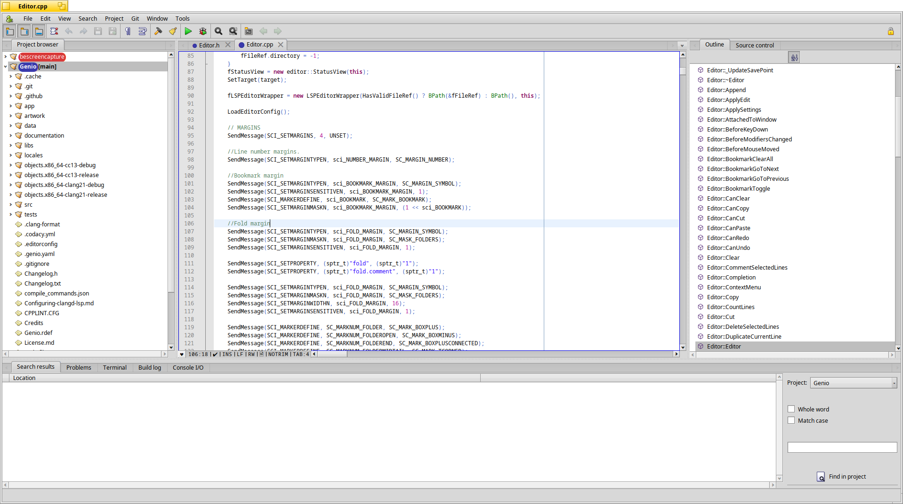
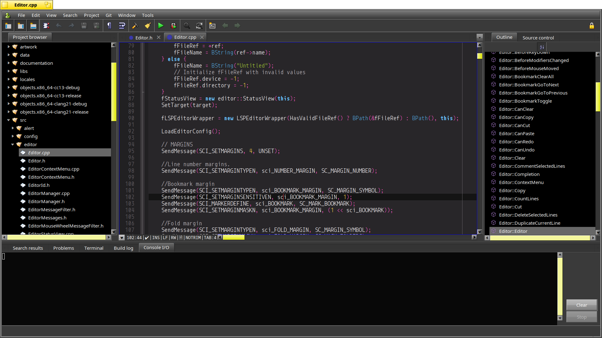

# Haikode

Haikode is a downstream fork of [Genio](https://codeberg.org/Genio/Genio), the
native Haiku IDE. The fork keeps Genio's native editor, project browser, Git,
LSP, terminal, and settings foundation, then adds supervised AI coding workflows
for cloud or local OpenAI-compatible LLMs.

See [HAIKODE.md](HAIKODE.md) for the fork direction and AI/vibecoding safety
model.

## Upstream Genio




## Introduction

Genio is a native and fully functional IDE for the [Haiku operating system](https://www.haiku-os.org)

Some of the features of the Genio IDE are:

* LSP Server support:
  * autocompletion
  * signature help
  * go to definition/implementation/declaration
  * find references
  * quick fix
  * code formatting
* Multi-project browser
* Customizable workspace
* Integrated source control with GIT (including opening a remote project)
* Find in files
* Links to file and build errors in Build Log and Console I/O
* Symbols outline view
* "Problems" tab
* Integrated terminal
* Build on save / Save on build
* User templates with placeholders for quickly creating new files and projects
* Rich editor with many features:
  * Multiple tabs
  * Syntax highlighting for many languages
  * Highlight/Trim whitespace
  * Comment/uncomment lines
  * Duplicate current line
  * Delete lines
  * Switch between source and header
* Full screen and Focus mode
* Scripting support (with hey)

Genio started off as a fork of [Ideam](https://github.com/AmosCaster/ideam), and
 the editor is based on [Scintilla for Haiku](https://sourceforge.net/p/scintilla/haiku/ci/default/tree/).

We also took inspiration and code from the editor [Koder](https://github.com/KapiX/Koder).

* strongly recommended for full Genio experience (autocompletion, jump to definition, etc):
  * gcc_syslibs_devel
  * llvm17_clang (or a newer version; tested with llvm22_clang as today)

```bash
pkgman install gcc_syslibs_devel cmd:clang
```

## Goals and roadmap

Genio aims to be an easy, simple yet powerful IDE for Haiku inspired by VS Code and Nova.

Planned features are:

* Integrated debugging
* Implement a Plug-in architecture
* Compiler error parser

## Configuring LSP

For more advanced IDE features, Genio implements the [LSP protocol](https://microsoft.github.io/language-server-protocol/)

* For C and C++ projects you can use clangd. See [Configuring-clangd-lsp.md](Configuring-clangd-lsp.md)
* For Python projects you can install and use [Python LSP Server](https://github.com/python-lsp/python-lsp-server)
* For C# projects you can install and use [OmniSharp](https://github.com/nexus6-haiku/omnisharp-roslyn-haiku)

## Building Genio

### Prerequirements

Genio requires Scintilla and Lexilla to implement various functionalities.
It also requires libgit2 to implement Git features, libyaml_cpp to read yaml files and
editorconfig_core_c to provide support for project wide .editorconfig settings.
The needed development files are available in `libgit2_1.9_devel`, `lexilla_devel`, `yaml_cpp0.8_devel`, `openssl3_devel`
and `editorconfig_core_c_devel` respectively. To install, open a terminal and type:

```bash
pkgman install libgit2_1.9_devel lexilla_devel yaml_cpp0.8_devel editorconfig_core_c_devel openssl3_devel lsp_framework
```

Haikode's AI provider transport is enabled by default and also requires curl:

```bash
pkgman install curl_devel
```

For an offline build without AI HTTP transport:

```bash
make HAIKODE_AI_NETWORK=0
```

### Configuring Haikode AI

Open **Window > Haikode AI** after launch. Credentials are stored in Haikode's
machine-local settings, not in the project and not through exported shell
variables.

Use **Window > Haikode AI setup** or the **AI Setup** button to paste the API
key inside the app. You do not need to run `export OPENAI_API_KEY`.
The setup dialog shows whether the binary was built with network AI support;
if it says network AI is disabled, rebuild with `HAIKODE_AI_NETWORK=1`.
The AI panel also shows an **AI readiness** line. After entering settings,
click **Save & Test**; the readiness line changes to ready, missing
credential, network disabled, local server/provider failure, or ready and
tested. This status never displays API keys or OAuth bearer tokens.

Use the **OpenAI**, **OpenRouter**, **Ollama**, **LM Studio**, or **llama.cpp**
buttons to fill the common base URL, model, and auth mode defaults, then adjust
the model if needed. Haikode normalizes auth mode text and trims leading/trailing
spaces from provider URLs, model names, API keys, and OAuth bearer tokens before
sending a request.

For OpenAI-compatible cloud providers, set:

* Base URL: `https://api.openai.com` or the provider endpoint.
* Model: the chat/completions model name.
* Auth: `api-key`.
* API key: paste the provider key in the Haikode AI panel or in **AI Setup**.

For OpenRouter, use the **OpenRouter** preset and paste your OpenRouter API key.

For local OpenAI-compatible servers such as Ollama, LM Studio, or llama.cpp,
set:

* Base URL: the local server root or `/v1` endpoint, for example
  `http://127.0.0.1:11434` or `http://127.0.0.1:11434/v1`.
* Auth: `local`.
* API key/OAuth token: leave blank.

For providers that expose generic OAuth 2.0 Authorization Code + PKCE, open
**AI Setup**, choose **OAuth**, set the OAuth auth URL, token URL, client ID,
scope, and a loopback redirect URI such as
`http://127.0.0.1:8765/callback`, then use **Start OAuth**. Haikode listens for
one localhost browser callback and exchanges the returned authorization code
automatically when possible. If the browser callback fails, paste either the
code or the full callback URL into **OAuth code** and click **Exchange code**.
Haikode stores the resulting bearer token in its app settings.

### Seeing project files in the AI panel

After opening a project folder, use **Project files** in the Haikode AI panel
to scan the active project for text/source files. Pick a file and press
**Open**; Haikode opens it through Genio's normal editor path and uses it as AI
context. This is also useful if the left project tree is collapsed, filtered,
or not visibly populated yet.

### Optional Codex CLI bridge

If the `codex` CLI is installed on Haiku and available in `PATH`, the AI panel
can prepare supervised Codex actions:

* **Codex status** queues `codex login status`.
* **Codex login** queues `codex login --device-auth`.
* **Ask Codex** queues a read-only `codex exec` request for the active project,
  then captures the approved command output back into the Haikode AI transcript.

Haikode does not read Codex token files. These actions are added to the pending
command list and still require an explicit **Run command** click. Captured
Codex output is parsed for unified diffs and command requests using the same
explicit review/apply flow as direct provider responses. Captured Codex runs
are also saved under `.haikode/logs/`.

Approved non-Codex command requests also run through Haikode's argv-native
capture path inside the active project. Output returns to the AI transcript and
is saved under `.haikode/logs/`; Haikode does not evaluate these requests as
shell command strings.

Use **Recent records** in the AI panel to pick from recent `.haikode/sessions`,
`.haikode/logs`, `.haikode/patches`, and `.haikode/commands` files for the
active project. **Show record** previews the path currently shown in the record
field. **Open record file** opens that saved record in Genio's editor.

AI patches cannot modify sensitive project metadata such as `.git/`,
`.haikode/`, `.genio`, or Haikode/Genio settings files.

If you would like to try a clang++ build:

* Install `llvm17_clang` and `llvm17_lld` hpkgs from HaikuPorts
* Set `BUILD_WITH_CLANG` to `1` in `Makefile`

### Compiling

Execute `make deps && make` in Genio's top directory.
The executable is created in `app` subdirectory.
After building, copy the `genio_terminal_addon` from libs/terminal into the `data` subdirectory.
Genio can also be built within Genio itself.

## Contributions

We gladly accept contributions, especially for bug fixes. Feel free to submit PRs.
For code contributions, prefer Haiku API over posix, where applicable.
We (try to) stick to the Haiku style for code, although we are a bit less strict sometimes.

## License

Genio is available under the MIT license. See [License.md](License.md).
Outline LSP icons are taken from Visual Studio Code and released under Creative Commons license.
See [Visual Studio Code - Icons](https://github.com/microsoft/vscode-icons)
